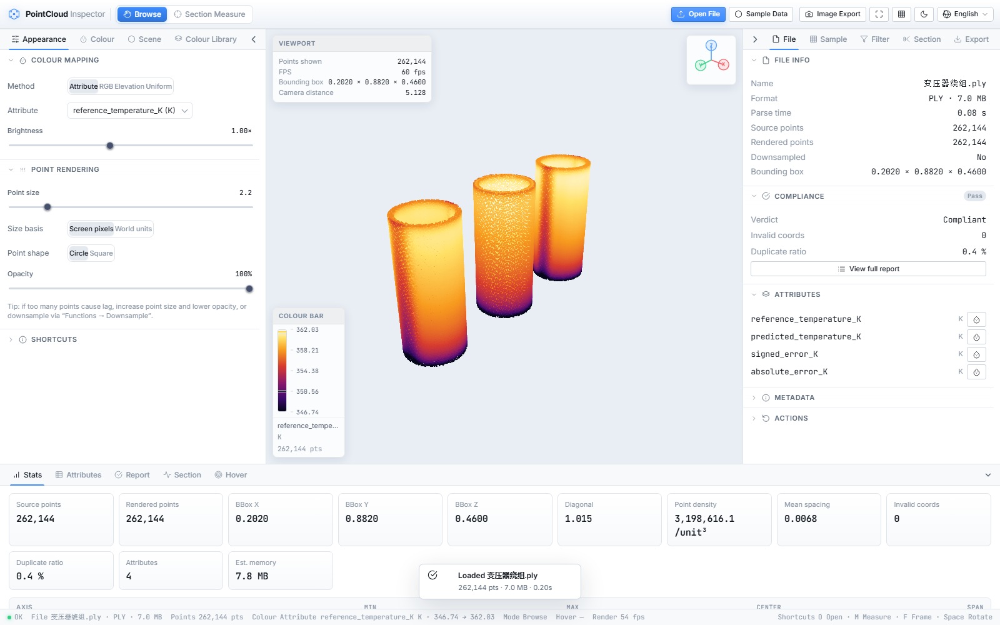
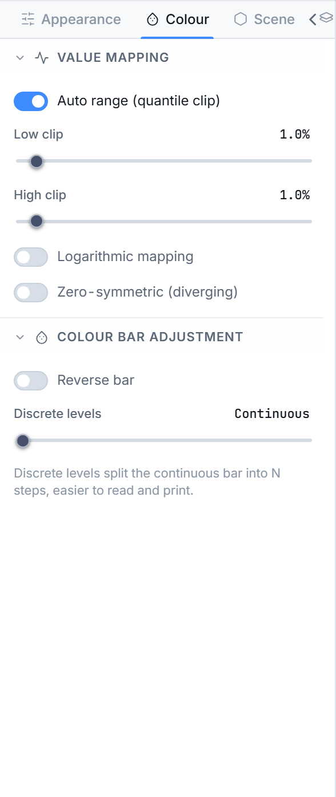
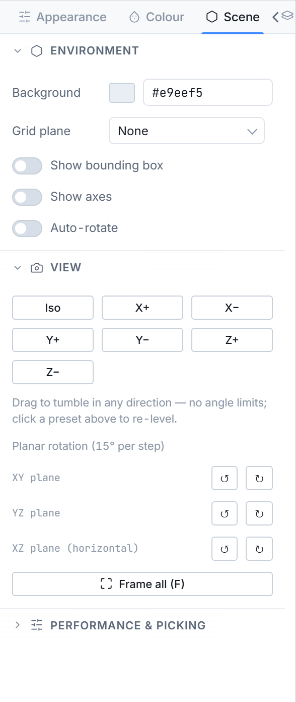
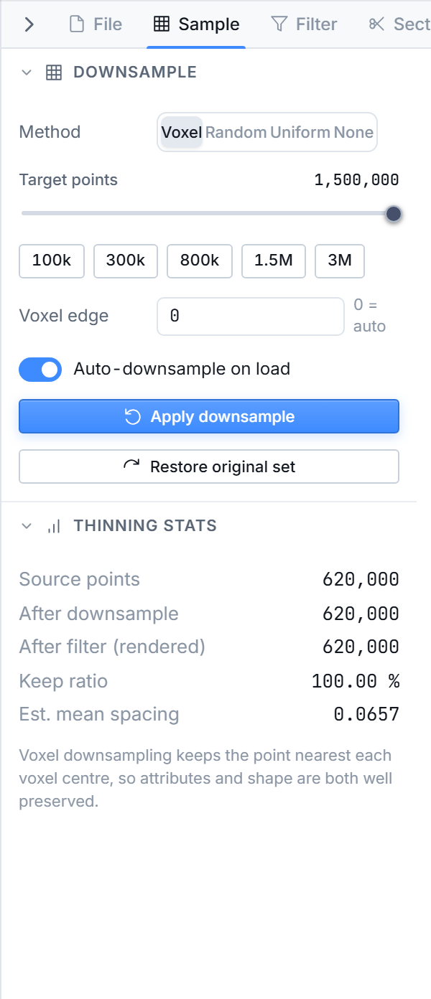
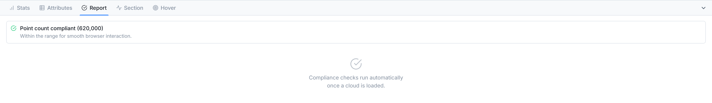
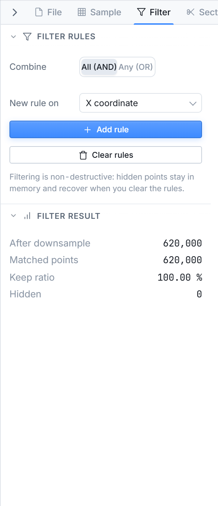
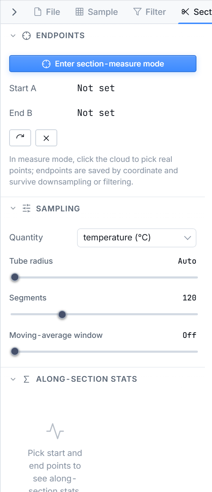
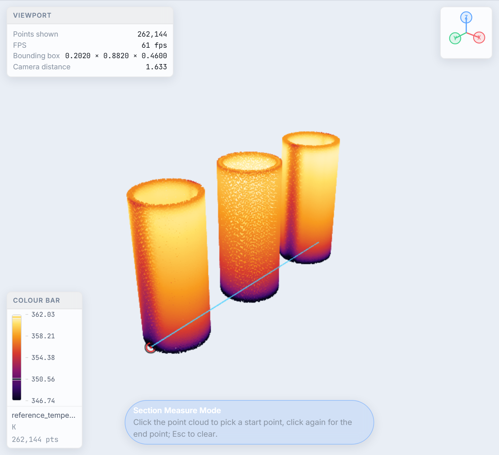
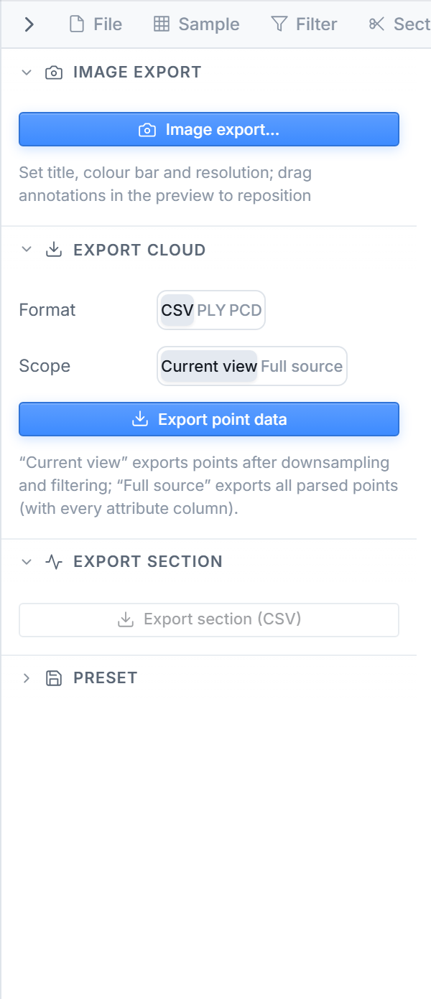

# PointCloud Inspector

[English](README.md) | [中文](README.zh-CN.md)


> A professional, fully client-side point cloud inspection & analysis tool that runs in your browser.

PointCloud Inspector is a web application for loading, validating, visualising and analysing 3D point clouds. Everything runs locally in the browser — **your files never leave your machine**. No backend, no upload, no account.



---

## Table of contents

- [Features](#features)
  - [High-performance WebGL rendering](#high-performance-webgl-rendering)
  - [Flexible colouring](#flexible-colouring)
  - [Scene & camera controls](#scene--camera-controls)
  - [Smart downsampling](#smart-downsampling)
  - [Compliance validation](#compliance-validation)
  - [Non-destructive filtering](#non-destructive-filtering)
  - [Section / profile analysis](#section--profile-analysis)
  - [Line / segment measurement](#line--segment-measurement)
  - [Spatial picking](#spatial-picking)
  - [Image export](#image-export)
  - [Data & session export](#data--session-export)
  - [Ergonomic UI](#ergonomic-ui)
- [Getting started](#getting-started)
- [Supported formats](#supported-formats)
- [Project structure](#project-structure)
- [Tech stack](#tech-stack)
- [npm scripts](#npm-scripts)
- [Privacy & performance notes](#privacy--performance-notes)
- [License](#license)

---

## Features

### High-performance WebGL rendering

A custom Three.js `ShaderMaterial` renders points with screen-space or world-space sizing, square/circle sprites, opacity, distance fog and a colour gain control. The viewport supports `TrackballControls` so the camera can tumble freely across both poles — essential when inspecting clouds where the up-axis is ambiguous.

The overview shot above shows the bundled transformer winding point cloud.

### Flexible colouring

Colour by any scalar attribute, by raw RGB from the file, by elevation (Z), or a single uniform colour. The LUT tab ships with built-in colormaps (viridis, terrain, thermal, jet, …) and the attribute name is used to **auto-guess** the right map (e.g. fields containing *temp* / *°C* get *thermal*). You can also import your own custom LUT as JSON.



Controls include percentile-based low/high clipping, logarithmic mapping, a zero-offset offset, reversal and a divergence (diverging) mode for fields with a meaningful midpoint.

### Scene & camera controls

The *Scene* tab gives you a fine-grained control over the scene: viewport background colour, grid plane (none/XY/XZ/YZ), bounding box, coordinate axes, auto-rotate (turntable), one-click view presets (isometric, ±X/±Y/±Z), per-plane rotation and *frame all*. Themes (dark/light) link the panel surfaces and the canvas background.



### Smart downsampling

The *Sampling* tab exposes four strategies — **voxel**, **random**, **uniform**, **none** — that operate on index buffers so the source arrays are never copied. Targets can be set explicitly or auto-sized; voxel edge length is auto-estimated when the *target* mode is on. Quick-pick chips (`100k / 300k / 800k / 1.5M / 3M`) cover common working-set sizes. A live *downsampling stats* card reports point counts and decimation ratio.



### Compliance validation

Every freshly-parsed cloud is run through a compliance check that detects invalid coordinates, duplicate ratios, suspicious coordinate magnitudes (often a unit mistake) and the fraction of points carrying RGB. The *Compliance report* dock surfaces all issues at a glance and recommends a safe target count when the cloud exceeds the soft limit.



### Non-destructive filtering

Build an arbitrary set of rules against X/Y/Z axes or named scalar attributes, in **range** mode (min/max) or **set** mode (e.g. LAS classification codes). Rules combine with **AND / OR** logic, can be individually toggled, and compose with downsampling and colouring without touching the source data. A live *filter stats* card shows how many points survive each pass.



### Section / profile analysis

Pick two points (A and B) on the cloud to define a segment; the profiler samples a cylindrical tube around the line and reduces the samples to a 1-D curve along the section. The result page reports min/max/mean/median/std, the location of extremes, the largest slope step and the least-squares trend, plus a scatter overlay of the raw samples.

You define the segment in [Line / segment measurement](#line--segment-measurement).



### Line / segment measurement

Switch to **measure mode** (the *剖面测量* / section-measure mode) from the mode switch in the top bar. Click any point on the cloud to drop the start pin **A**, then click a second point to drop **B** — a highlighted segment is drawn straight across the viewport between the two endpoints, and its length is read out in the hint bar. Press **Esc** to clear the current segment and start over.

The segment you define also drives the section / profile analysis: once A and B are set, the profiler samples a cylindrical tube around the line and reduces it to the 1-D curve described in [Section / profile analysis](#section--profile-analysis).



### Spatial picking

**Pick** any point to inspect its position and attribute values in the hover card; coordinates are projected onto the cursor with depth-aware display so you can identify outliers quickly. Hovering also highlights the nearest point and reports its distance from the camera.

### Image export

The camera button in the top bar opens the **image export** dialog. Configure an optional title, toggle the colour-bar / legend, and choose the output size (match the viewport or a fixed resolution), then export the current rendered viewport as a **PNG**. The background follows your scene settings, so the export matches exactly what you see on screen.



### Data & session export

Save the current cloud as **CSV / PLY / PCD** (ASCII), the profile curve as **CSV**, or the entire session as a reusable **JSON preset** that restores your camera, colouring, filters and selection. (Rendered-viewport PNG export lives in [Image export](#image-export).)

### Ergonomic UI

Resizable, collapsible panels (left / right / bottom dock) with keyboard shortcuts (`Ctrl+1 / Ctrl+2 / Ctrl+3` to toggle). Light and dark themes with linked surfaces. Charts in the data dock visualise attribute distributions. The bundled demo cloud is one click away from the welcome screen.

---

## Getting started

### Prerequisites

- [Node.js](https://nodejs.org/) 18+ (Node 20 recommended)

### Install & run

```bash
# install dependencies
npm install

# start the dev server (default http://localhost:5173)
npm run dev

# type-check only
npm run typecheck

# production build (outputs to dist/)
npm run build

# preview the production build locally
npm run preview
```

Then open the URL printed by Vite and **drag a point cloud file** onto the viewport (or use *Load file* / *Load demo data* on the welcome screen).

---

## Supported formats

| Format | Label | Notes | Binary |
| ------ | ----- | ----- | ------ |
| `.las` | LAS | ASPRS lidar standard 1.0–1.4 | ✔ |
| `.laz` | LAZ | Lossless compression of LAS | ✔ |
| `.pcd` | PCD | PCL — ascii / binary / LZF | ✔ |
| `.ply` | PLY | Polygon File Format (Stanford) | ✔ |
| `.pts` | PTS | Leica scanner text point cloud | |
| `.ptx` | PTX | Text point cloud with poses | |
| `.xyz` | XYZ | Plain coordinates, optional attribute columns | |
| `.csv` | CSV | Tabular cloud with header | |
| `.txt` | TXT | Generic delimited text | |
| `.obj` | OBJ | Wavefront — vertices only | |
| `.bin` | BIN | Raw `float32` xyz triplet stream | ✔ |

For delimited text formats (CSV/TXT/XYZ/PTS/PTX) a column-mapping dialog lets you assign which columns are X / Y / Z and which carry extra scalar attributes. Files with unknown extensions are sniffed by content.

---

## Project structure

```
pointcloudChecker/
├─ index.html              # App shell (top bar, panels, viewport, dock, status bar)
├─ src/
│  ├─ main.ts              # Entry point — loads styles, boots App
│  ├─ app.ts               # Orchestrator: state store + viewer + all interactions
│  ├─ core/                # Pure logic, no DOM
│  │  ├─ cloud.ts          # Cloud model, statistics, sampling helpers
│  │  ├─ colormap.ts       # Built-in + custom LUTs, auto-guess by name
│  │  ├─ downsample.ts     # voxel / random / uniform index strategies
│  │  ├─ filters.ts        # Range & set filter rules (AND/OR)
│  │  ├─ profile.ts        # Section/profile sampling + statistics
│  │  ├─ validate.ts       # Compliance checks & sanitisation
│  │  ├─ state.ts          # Central reactive store & types
│  │  └─ demo.ts           # Bundled sample cloud
│  ├─ io/                  # Parsers & exporters
│  │  ├─ index.ts          # Format detection + dispatch
│  │  ├─ las.ts  laz.ts    # LAS / LAZ (via laz-perf)
│  │  ├─ pcd.ts ply.ts obj.ts raw.ts
│  │  ├─ text.ts           # CSV/TXT/XYZ/PTS/PTX with header mapping
│  │  └─ export.ts         # CSV / PLY / PCD / image / preset export
│  ├─ render/
│  │  └─ Viewer.ts         # WebGL viewport, shader, camera, picking, measurement
│  ├─ ui/                  # Views over App + store (no business logic)
│  │  ├─ panelSettings.ts  # Render & colour settings
│  │  ├─ panelFunctions.ts # Downsample / filter / profile / measure
│  │  ├─ panelData.ts      # Statistics, charts, table
│  │  ├─ exportDialog.ts   # Export wizard
│  │  ├─ columnDialog.ts   # Text column mapping
│  │  ├─ legend.ts chart.ts controls.ts dom.ts
│  └─ styles/              # Design tokens → base → components → app shell
├─ docs/shots/             # README screenshots, per language: en/ (English UI), zh/ (Chinese UI)
├─ scripts/                # README screenshot generator
└─ vite.config.ts
```

The architecture separates **`core`** (pure, DOM-free algorithms), **`io`** (parsing/serialisation), **`render`** (WebGL), and **`ui`** (declarative views driven by a single reactive `Store`). This keeps the heavy lifting testable and the panels as thin observers over application state.

---

## Tech stack

| Area | Choice |
| ---- | ------ |
| Language | TypeScript (strict) |
| Build / dev | Vite 5 |
| 3D / WebGL | Three.js (custom `ShaderMaterial`, `TrackballControls`) |
| LAZ decode | `laz-perf` |
| UI | Hand-rolled DOM components + CSS variables (light/dark themes) |

---

## npm scripts

| Script | Description |
| ------ | ----------- |
| `npm run dev` | Start the Vite dev server with HMR. |
| `npm run build` | Type-check (`tsc --noEmit`) then build to `dist/`. |
| `npm run preview` | Serve the production build locally. |
| `npm run typecheck` | Run TypeScript type checks without emitting. |
| `node scripts/readme-shots.mjs [url] [lang]` | Regenerate the README screenshots for the given language into `docs/shots/<lang>/` (requires `npm run dev`; defaults to `en`). |

---

## Privacy & performance notes

- **Local only.** Files are read with the File API and parsed in the browser. Nothing is uploaded to any server.
- **Memory aware.** A *soft* limit (~1.5 M points) triggers automatic downsampling; a *hard* limit (~40 M points) avoids rendering the full set to protect the tab.
- **Large files.** For multi-million point clouds, prefer LAZ/LAS (decoded efficiently) and let voxel downsampling reduce the working set.

---

## FAQ

**Does it upload my point cloud?**
No. Parsing and rendering run entirely in your browser through the File API and WebGL. No file ever leaves your machine.

**How many points can it handle?**
A *soft* limit (~1.5 M) triggers automatic downsampling; a *hard* limit (~40 M) avoids full-resolution rendering so the tab stays responsive. For very large clouds, prefer LAZ/LAS and let voxel downsampling shrink the working set.

**Which formats are supported?**
LAS, LAZ, PCD, PLY, PTS, PTX, XYZ, CSV, TXT, OBJ and raw BIN. Unknown extensions are detected by content, and delimited text formats prompt a column-mapping dialog.

**Can I use it commercially?**
Yes. The project is released under the [GNU General Public License v3.0](#license) (**GPL-3.0**), a strong copyleft license: you may use, study, modify and redistribute it for any purpose, including commercial, provided that derivative works are also distributed under GPL-3.0 (with source made available).

**Does it work on mobile?**
It is a desktop-first WebGL app. A mouse/trackpad is recommended; touch input works but is not the primary target.

**How do I load a custom LUT or remap text columns?**
Open the *LUT* tab in the left panel to import a custom colormap JSON. For CSV/TXT/XYZ/PTS/PTX files the column-mapping dialog lets you choose which columns are X / Y / Z and which carry extra scalar attributes.

---

## License

This project is released under the **GNU General Public License v3.0** (**GPL-3.0**). See [`LICENSE`](LICENSE) for the full text.

You are free to use, study, modify and redistribute the software for any purpose, including commercial use, provided that derivative works are also licensed under GPL-3.0 and their complete corresponding source code is made available under the same terms. There is no warranty; see the license for details.

---

*PointCloud Inspector — inspect, validate and understand your point clouds, entirely in the browser.*
### Bundled sample

The bundled sample is a transformer winding point cloud. Select **Sample Data** to load it.
