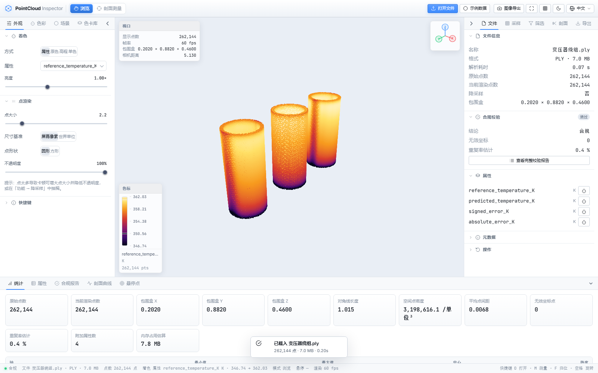
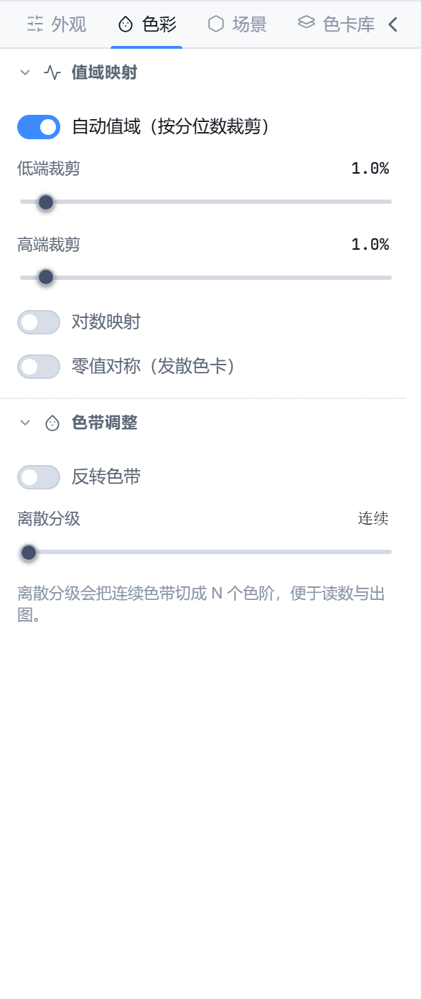
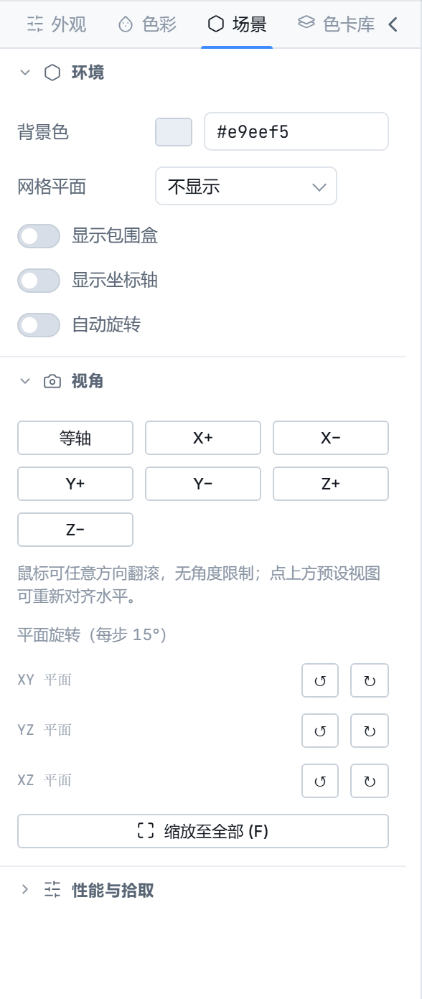
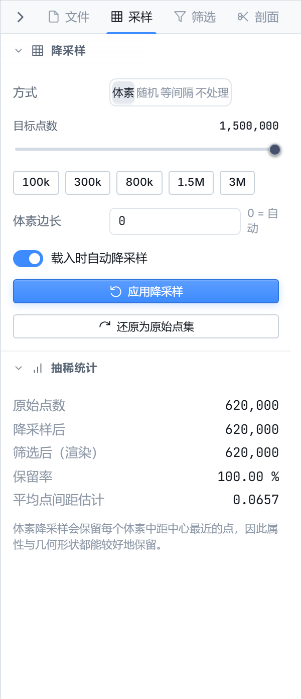
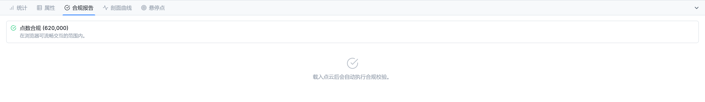
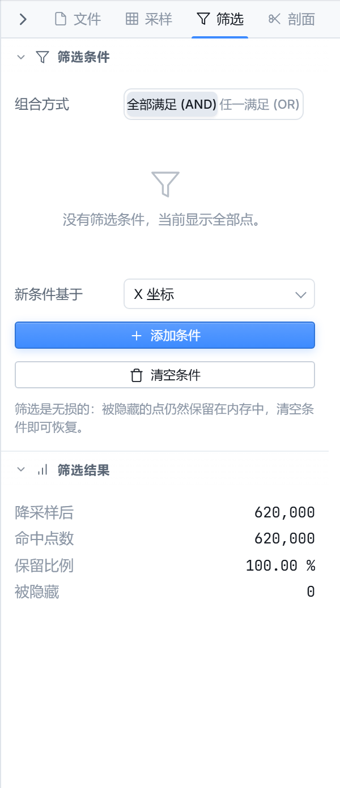
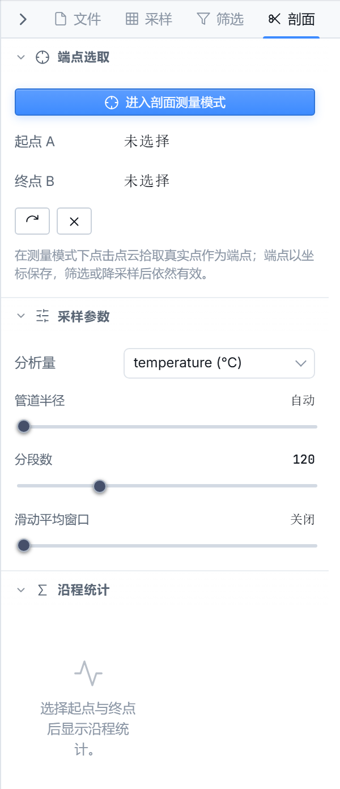
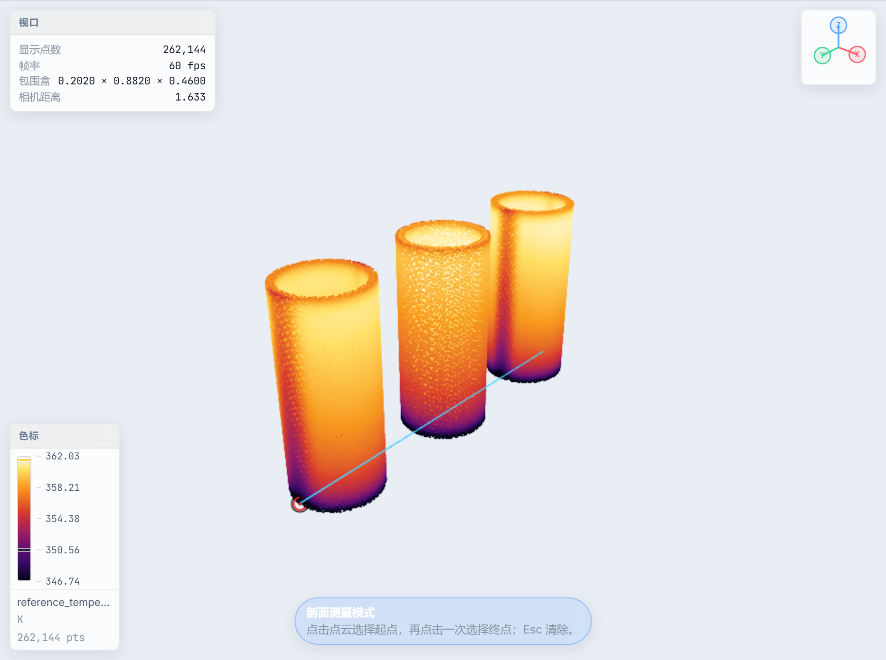
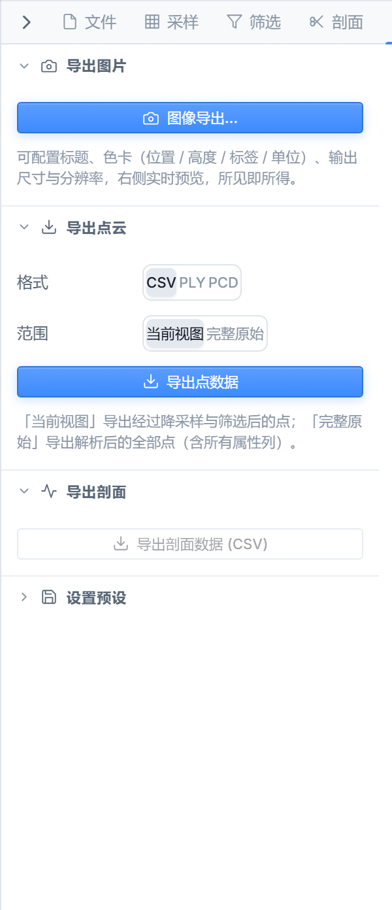

# PointCloud Inspector（点云检查器）

[English](README.md) | [中文](README.zh-CN.md)


> 一款完全运行在浏览器中的专业级点云检查与分析工具。

PointCloud Inspector 是一个用于加载、校验、可视化和分析三维点云的 Web 应用。所有处理都在浏览器本地完成 —— **文件不会上传到任何服务器**。无需后端、无需登录、无需注册。

英文版请见：[README.md](README.md)



---

## 目录

- [核心功能](#核心功能)
  - [高性能 WebGL 渲染](#高性能-webgl-渲染)
  - [灵活的上色方式](#灵活的上色方式)
  - [场景与相机控制](#场景与相机控制)
  - [智能降采样](#智能降采样)
  - [合规校验](#合规校验)
  - [非破坏性筛选](#非破坏性筛选)
  - [剖面 / 剖切分析](#剖面--剖切分析)
  - [线段测量（截线测量）](#线段测量截线测量)
  - [点选取](#点选取)
  - [图像导出](#图像导出)
  - [数据与会话导出](#数据与会话导出)
  - [贴心的界面](#贴心的界面)
- [快速开始](#快速开始)
- [支持的文件格式](#支持的文件格式)
- [项目结构](#项目结构)
- [技术栈](#技术栈)
- [npm 脚本](#npm-脚本)
- [隐私与性能说明](#隐私与性能说明)
- [许可证](#许可证)

---

## 核心功能

### 高性能 WebGL 渲染

基于 Three.js 自定义的 `ShaderMaterial`，支持屏幕空间 / 世界空间点尺寸、方块 / 圆形点、透明度、距离雾效以及颜色增益。视口使用 `TrackballControls`，可以自由翻滚跨越两极 —— 对于上方向不明确的点云尤为重要。

上面的总览图展示了内置的变压器绕组点云。

### 灵活的上色方式

支持按任意标量属性着色、按文件自带的 RGB 着色、按高程（Z 轴）着色，或使用单一颜色。"色卡库"内置了多种色板（viridis、terrain、thermal、jet …），并会根据属性名称**自动匹配**合适的色板（例如包含 *temp* / *°C* 的字段会自动使用 *thermal*）。你也可以导入自定义 JSON 色板。



控制项包括基于分位数的低 / 高裁剪、对数映射、零点偏移、反转，以及适合具有"中点"语义的字段的发散（diverging）模式。

### 场景与相机控制

"场景"页提供对场景的细粒度控制：视口背景色、网格平面（无 / XY / XZ / YZ）、包围盒、坐标轴、自动旋转（转台）、一键视角预设（等轴、±X / ±Y / ±Z）、按平面旋转以及"框选全部"。深色 / 浅色主题会自动联动面板和画布背景。



### 智能降采样

"采样"页提供四种策略 —— **体素（voxel）**、**随机（random）**、**等距（uniform）**、**不采样（none）** —— 全部基于索引缓冲区操作，源数组不会被复制。目标点数可显式指定或自动估算；启用 *目标* 模式时体素边长会自动估算。快捷预设（`100k / 300k / 800k / 1.5M / 3M`）覆盖了常见的可操作集合大小。"降采样统计"卡片实时显示点数与压缩比。



### 合规校验

每份新加载的点云都会经过合规检查，自动发现无效坐标、重复率、异常的坐标量级（通常是单位错误）以及携带 RGB 的点占比。"合规报告"面板一目了然地展示所有问题，并在点云超过软上限时给出推荐的目标点数。



### 非破坏性筛选

可以针对 X / Y / Z 坐标或命名的标量属性建立任意数量的规则，支持 **范围（range）** 模式（最小 / 最大值）或 **集合（set）** 模式（例如 LAS 分类码）。多条规则以 **AND / OR** 逻辑组合，可单独启用 / 禁用，并且可以与降采样、着色叠加使用，而不会修改源数据。"筛选结果"卡片实时显示每一步之后保留了多少点。



### 剖面 / 剖切分析

在点云上拾取 A、B 两点定义一条线段，分析器沿线段周围的圆柱形管道内采样，并将其归约为沿剖面的一维曲线。结果页报告最小 / 最大 / 平均 / 中位数 / 标准差、极值位置、最大相邻差和最小二乘趋势，并附带原始采点的散点叠加显示。

线段在[线段测量（截线测量）](#线段测量截线测量)中定义。



### 线段测量（截线测量）

在顶栏的模式切换中选择 **测量模式**（剖面测量）。在点云上点击任意点放置起点标记 **A**，再点击一次放置终点 **B** —— 视口中会直接绘制一条连接两个端点的高亮线段，并在提示栏读出其长度。按 **Esc** 可清除当前线段并重新开始。

你定义的这条线段同时驱动"剖面 / 剖切分析"：A、B 两点确定后，分析器会沿线段周围的圆柱形管道采样，并归约为一维曲线（见[剖面 / 剖切分析](#剖面--剖切分析)）。



### 点选取

**点选**任意一点，即可在悬浮卡片中查看其位置与属性值；坐标会按深度感知方式投影到光标位置，便于快速识别异常点。悬停时还会高亮最近的点，并报告其到相机的距离。

### 图像导出

顶栏的相机按钮会打开**图像导出**对话框。可配置可选的标题、开关色卡 / 图例，并选择输出尺寸（匹配视口或固定分辨率），随后将当前渲染的视口导出为 **PNG**。背景遵循场景设置，因此导出结果与屏幕所见完全一致。



### 数据与会话导出

当前点云可导出为 **CSV / PLY / PCD**（ASCII），剖面曲线可导出为 **CSV**，整个会话可保存为可复用的 **JSON 预设**，以便恢复相机、着色、筛选和选区状态。（渲染视口的 PNG 导出见[图像导出](#图像导出)。）

### 贴心的界面

左侧 / 右侧 / 底部三个面板均可调整大小、折叠，并配有快捷键（`Ctrl+1 / Ctrl+2 / Ctrl+3`）。深色 / 浅色主题自动联动。底部数据面板中图表可直观显示属性分布。欢迎页一键加载内置示例数据。

---

## 快速开始

### 环境要求

- [Node.js](https://nodejs.org/) 18+（推荐 Node 20）

### 安装与运行

```bash
# 安装依赖
npm install

# 启动开发服务器（默认 http://localhost:5173）
npm run dev

# 仅类型检查
npm run typecheck

# 生产构建（输出到 dist/）
npm run build

# 本地预览生产构建
npm run preview
```

打开 Vite 给出的 URL，然后将**点云文件拖入视口**（或在欢迎页点击"选择文件"/"载入示例数据"）。

---

## 支持的文件格式

| 格式 | 名称 | 说明 | 二进制 |
| ---- | ---- | ---- | ------ |
| `.las` | LAS | ASPRS 激光雷达标准 1.0–1.4 | ✔ |
| `.laz` | LAZ | LAS 的无损压缩格式 | ✔ |
| `.pcd` | PCD | PCL 点云格式（ascii / binary / LZF） | ✔ |
| `.ply` | PLY | Stanford 多边形文件格式 | ✔ |
| `.pts` | PTS | Leica 扫描仪文本点云 | |
| `.ptx` | PTX | 带位姿的文本点云 | |
| `.xyz` | XYZ | 纯坐标文本，可带属性列 | |
| `.csv` | CSV | 带表头的表格点云 | |
| `.txt` | TXT | 通用分隔文本 | |
| `.obj` | OBJ | Wavefront，仅取顶点 | |
| `.bin` | BIN | 原始 float32 三元组流 | ✔ |

对于带分隔符的文本格式（CSV / TXT / XYZ / PTS / PTX），会弹出列映射对话框，让你指定哪一列是 X / Y / Z，哪几列携带额外的标量属性。未知扩展名的文件会按内容嗅探识别。

---

## 项目结构

```
pointcloudChecker/
├─ index.html              # 应用外壳（顶栏、面板、视口、底部面板、状态栏）
├─ src/
│  ├─ main.ts              # 入口 —— 加载样式、启动 App
│  ├─ app.ts               # 编排器：状态存储 + 视口 + 所有交互
│  ├─ core/                # 纯逻辑，无 DOM
│  │  ├─ cloud.ts          # 点云模型、统计、采样辅助
│  │  ├─ colormap.ts       # 内置 + 自定义色板，按名称自动匹配
│  │  ├─ downsample.ts     # 体素 / 随机 / 等距索引策略
│  │  ├─ filters.ts        # 范围与集合筛选规则（AND / OR）
│  │  ├─ profile.ts        # 剖面采样与统计
│  │  ├─ validate.ts       # 合规检查与清洗
│  │  ├─ state.ts          # 中央响应式存储与类型定义
│  │  └─ demo.ts           # 内置示例点云
│  ├─ io/                  # 解析与导出
│  │  ├─ index.ts          # 格式识别与派发
│  │  ├─ las.ts  laz.ts    # LAS / LAZ（基于 laz-perf）
│  │  ├─ pcd.ts ply.ts obj.ts raw.ts
│  │  ├─ text.ts           # CSV / TXT / XYZ / PTS / PTX，带表头映射
│  │  └─ export.ts         # CSV / PLY / PCD / 图像 / 预设导出
│  ├─ render/
│  │  └─ Viewer.ts         # WebGL 视口、shader、相机、点选、测量
│  ├─ ui/                  # 基于 App + store 的纯视图（无业务逻辑）
│  │  ├─ panelSettings.ts  # 渲染与着色设置
│  │  ├─ panelFunctions.ts # 降采样 / 筛选 / 剖面 / 测量
│  │  ├─ panelData.ts      # 统计、图表、表格
│  │  ├─ exportDialog.ts   # 导出向导
│  │  ├─ columnDialog.ts   # 文本列映射对话框
│  │  ├─ legend.ts chart.ts controls.ts dom.ts
│  └─ styles/              # 设计令牌 → 基础 → 组件 → 应用外壳
├─ docs/shots/             # README 截图，按语言分目录：en/（英文界面）、zh/（中文界面）
├─ scripts/                # README 截图生成脚本
└─ vite.config.ts
```

整体架构将 **`core`**（纯算法）、**`io`**（解析 / 序列化）、**`render`**（WebGL）以及 **`ui`**（由中央响应式 `Store` 驱动的声明式视图）清晰分开。这样既保证了重逻辑可测试，也让各面板仅仅是应用状态的"观察者"。

---

## 技术栈

| 领域 | 选择 |
| ---- | ---- |
| 语言 | TypeScript（strict） |
| 构建 / 开发 | Vite 5 |
| 3D / WebGL | Three.js（自定义 `ShaderMaterial`，`TrackballControls`） |
| LAZ 解码 | `laz-perf` |
| UI | 自研 DOM 组件 + CSS 变量（深色 / 浅色主题） |

---

## npm 脚本

| 脚本 | 说明 |
| ---- | ---- |
| `npm run dev` | 启动 Vite 开发服务器（带 HMR）。 |
| `npm run build` | 先类型检查（`tsc --noEmit`），再构建到 `dist/`。 |
| `npm run preview` | 本地预览生产构建。 |
| `npm run typecheck` | 仅运行 TypeScript 类型检查。 |
| `node scripts/readme-shots.mjs [url] [lang]` | 按指定语言重新生成 README 截图到 `docs/shots/<lang>/`（需先 `npm run dev`；默认 `en`）。 |

---

## 隐私与性能说明

- **完全本地。** 文件通过 File API 读取并在浏览器内解析，不会上传到任何服务器。
- **内存感知。** 当点数超过软上限（约 150 万）时自动降采样；超过硬上限（约 4000 万）时拒绝全分辨率渲染，避免页面卡顿。
- **大文件建议。** 对于数百万点的点云，优先使用 LAZ / LAS（解码更高效），并通过体素降采样减少工作集。

---

## 常见问题

**点云数据会上传吗？**
不会。所有解析与渲染都在浏览器内通过 File API 与 WebGL 完成，文件不会离开你的设备。

**最多能处理多少点？**
当点数超过软上限（约 150 万）时会自动降采样；超过硬上限（约 4000 万）时会拒绝全分辨率渲染以保持页面流畅。对于超大点云，建议优先使用 LAZ / LAS，并通过体素降采样压缩工作集。

**支持哪些格式？**
LAS、LAZ、PCD、PLY、PTS、PTX、XYZ、CSV、TXT、OBJ 以及原始 BIN。未知扩展名会按内容自动识别；带分隔符的文本格式会弹出列映射对话框。

**可以商用吗？**
可以。本项目采用 [GNU 通用公共许可证 v3.0](#许可证)（**GPL-3.0**），这是一种强 copyleft 许可证：你可以出于任何目的（含商业用途）使用、学习、修改和再分发，但衍生作品也必须在 GPL-3.0 下发布并提供完整对应源码。

**支持移动端吗？**
本应用是桌面优先的 WebGL 应用，推荐使用鼠标 / 触控板；触屏可用，但并非主要适配场景。

**怎么导入自定义色板或重新映射文本列？**
打开左侧面板的"色卡库"页可导入自定义色板 JSON；加载 CSV / TXT / XYZ / PTS / PTX 文件时会弹出列映射对话框，可指定哪一列是 X / Y / Z，哪几列承载额外标量属性。

---

## 许可证

本项目采用 **GNU 通用公共许可证 v3.0**（**GPL-3.0**）发布，完整条款见 [`LICENSE`](LICENSE)。

你可以出于任何目的（包括商业用途）自由地使用、学习、修改和再分发本软件，但衍生作品也必须在 GPL-3.0 下授权，并提供完整对应的源码。本软件不提供任何担保，详见许可证文本。

---

*PointCloud Inspector —— 完全在浏览器内检查、校验并理解你的点云。*
### 内置示例数据

内置示例为变压器绕组点云。点击「示例数据」即可载入。
